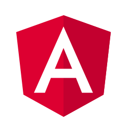

# Angular Best Practices

Is Your Head in an **Angular Cloud**?

Clear things up with some tips on the Best Practices in developing rich applications using Angular. There is no 100% "best way" of writing code, but there definitely is a wrong way. This documentation is gathered from experiences, "trial and error", and growth of the Angular framework.

- [Structure](docs/structure.md)
- [Technology Stack](docs/technology-stack.md)
- [RxJS Best Practices](docs/rxjs-best-practices.md)
  - [Flattening Map Operators](docs/flattening-map-operators.md)
  - [Common Patterns](docs/common-patterns.md)
- [State Management](docs/state-management.md)
- [Error Handling](docs/error-handling.md)
- [API Connections & Mocking](docs/api-connections.md)
- [Logging](docs/logging.md)
- [CSS Best Practices](docs/css-best-practices.md)
  - [BootStrap](docs/scss-bootstrap.md)
  - [Material](docs/scss-material.md)
- [Performance Considerations](docs/performance-considerations.md)
- [Debugging Techniques](docs/debugging-techniques.md)

## Introduction
Angular is characterized as a highly structured, comprehensive, and opinionated framework. The Angular team has published extensive [documentation](https://angular.io/docs) including a [Style Guide](https://angular.io/guide/styleguide) for creating well-structured, organized applications. The style guide is a great resource and should be followed extensively as a first step to creating your application. This will help your project stay organized as well as help other Angular developers understand and become productive quickly when joining your project as the style guide is well followed within the industry.

This guide serves as an additional resource to helping you structure your application beyond the style guide guidance. Through practical project experience, there are some considerations and patterns that can be helpful as documented here.

### Getting Started
It is highly recommended to use the [Angular CLI](https://cli.angular.io/). Avoid ejecting the CLI scripts. This should be used only as a last resort to support special build requirements.

If using the Angular CLI, update using `ng udpate` when possible.

In order to start following all the best practices documented in this repository, we have created a blueprint, a base project that can be cloned and should be used as the base project for your specific development. This way you will accelerate your development and adopting all of our proposals from scratch.

You can find it here: [blueprint folder](blueprint/).