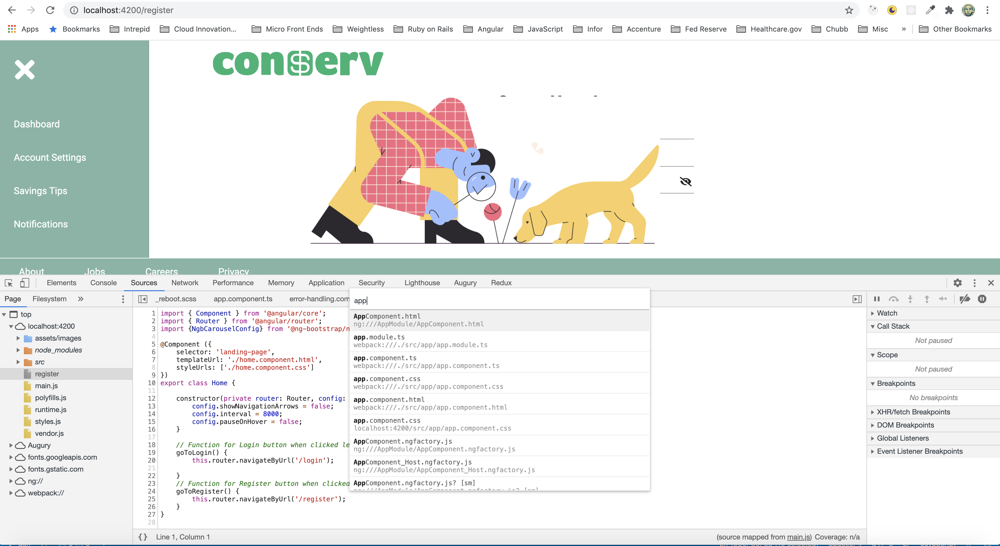
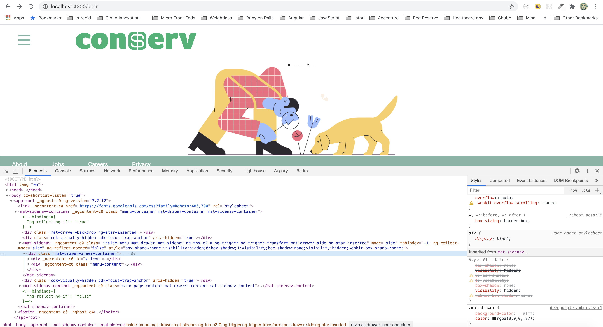
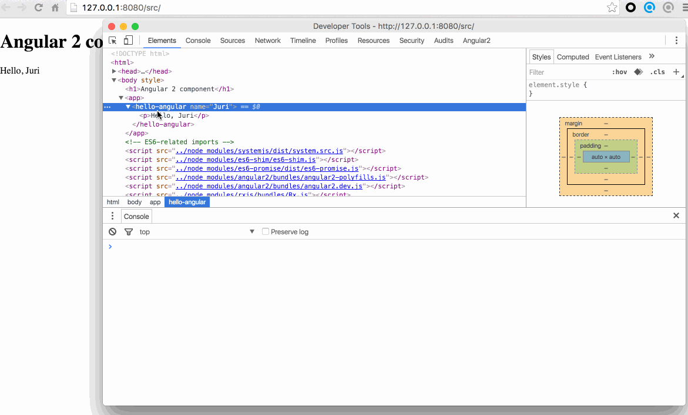

# Debugging Techniques

## Sourcemaps
**Sourcemaps** are a powerful way to debug your Typescript code as you have written it directly within your browser. 

The browser natively executes plain javascript code that has been transpiled to Typescript, and the sourcemaps are the link from the javascript in your browser to the Typescript that you originally wrote. If your application has been build with **angular-cli**, the tooling is already in place to generate sourcemaps and you should be able to directly debug using them when running the application locally. 

>To do this, start your app, open the inspector (preferrably Chrome) and go to the *Sources* panel. Using Ctrl+P (command+P in Mac) will open a file search box with autocomplete. You can search for the file you'd like to debug here. NOTE: there is a setting that may need to be set in Chrome developer tools to enable sourcemaps in *Settings/Preferences/Sources/Enable JavaScript source maps* checkbox.



Once the file (source map) is visible in *Sources Panel*, you can directly set breakpoints into your Typescript code and step through the logic. Additionally, you can hover over variables and inspect their values, or even switch tabs to the console and manually set variable values or try to execute functions.

Using the *Sources Panel* is very powerful, and should eliminate the need to manually write console.log statements and rebuild the application.

## CSS Sourcemaps
Sourcemaps also apply to CSS (concatenated CSS) and **SCSS**. SCSS is transpiled and concatenated in a similar way that Typescript transpiles down to Javascript. If you have generated your app using the **angular-cli**, the tooling should already be in place to generate SCSS and CSS sourcemaps when developing locally. 



>There is a checkbox to enable CSS sourcemaps within the Chrome developer tools:  *Settings/Preferences/Sources/Enable CSS source maps* checkbox. This enables you to see the exact `.scss` or `.css` file that has affected the resulting style that you see on an element in the inspector. This will be visible on the upper right corner in the styles panel.


## Debugging Component Instance Through Console
Sometimes, it is convenient to directly grab an Angular component through the 'Elements' tab and inspect it's properties. We can do this by again selecting our component in the elements tab and then executing the following in the console.

```shell
ng.probe($0)
```

Expand the result object in the devtools and navigate through it. There are are a couple of interesting things being exposed to you. Most interestingly, we can get a reference to the instance of our component class using..
```shell
ng.probe($0).componentInstance
```

Once we have that instance, we can interact with it, like changing the name property in the case of our simple hello world component example. 


We can even invoke the component's change detector to see the update on the UI.

```shell
ng.probe($0)._debugInfo._view.changeDetectorRef.detectChanges()
```

## Debugging with Augury
Another debugging tool at your disposal is a browser extension called [Augury](https://augury.rangle.io/). This enables an extra panel within the browser Developer Tools. **Augury** can display all the components within the application, and their heirarchy. You can also inspect some of the state of the components on the right. Additionally, you can see the **Router tree** and the **Imported Modules**.


# Feature Flipping
Feature flipping is a simple way to keep features in active development without exposing them to users before they are ready. This is relatively simple to implement with an [Angular service](https://angular.io/guide/singleton-services), which is a **singleton pattern**.

```typescript
import { Injectable } from '@angular/core';

@Injectable({
  providedIn: 'root',
})
export class FeatureFlipperService {

  private features = {
    hasMockHeroes: true,
    hasMockUsers: false,
  }

  constructor() { }

  getFeature(feature: string): boolean {
    return !!this.features[feature];
  }
}

/* 
Inject this service where applicable and use if branching to add and remove features. 
For example, a common use case is to switch between a mocked data service and a live data service when the API becomes available from a backend developer. 
*/

getHeroes(): Observable<Hero[]> {
  return (FeatureFlipperService.getFeature('hasMockHeroes')) ? of(HEROES) : this.http.get(`${this.baseUrl}\heroes`);
}
```
