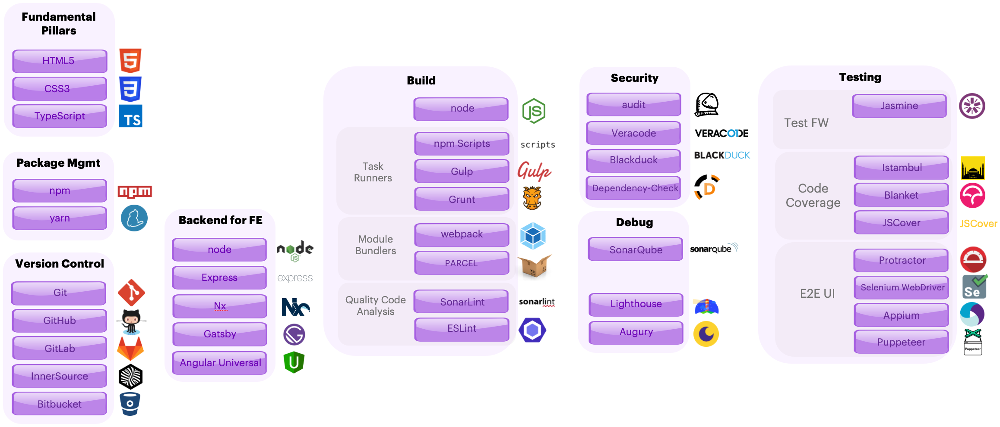

# Technology Stack

Angular applications can be developed using different IDE tools like:
- [Microsoft Visual Studio Code](https://code.visualstudio.com/)
- [JetBrains WebStorn](https://www.jetbrains.com/webstorm/)
- [Angular IDE](https://www.genuitec.com/products/angular-ide/) 
  
...or more general tools like [Sublime Text](https://www.sublimetext.com/) or [Atom](https://atom.io/.)

The same situation happens for testing, build, package management, version control, debug, where multiple choices are available. 

In this situation, it's very important to define what we want to use in our projects, to avoid incompatible tools, licenses, type of support, LTS versions... so each tool, framework, library, dependency, plugin or package needs to be validated on beforehand. 

Here is our validated technology stack based not only on above parameters but also on experiences in multiple projects:

